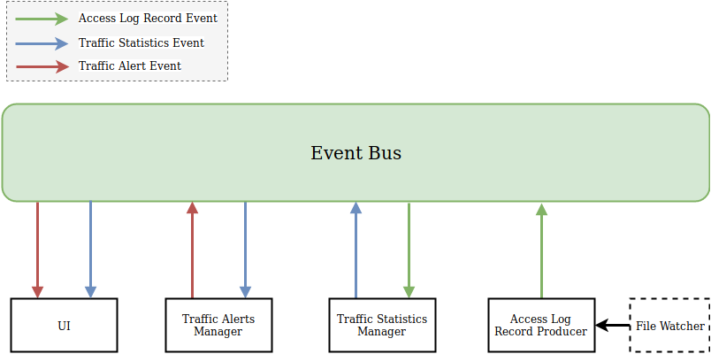
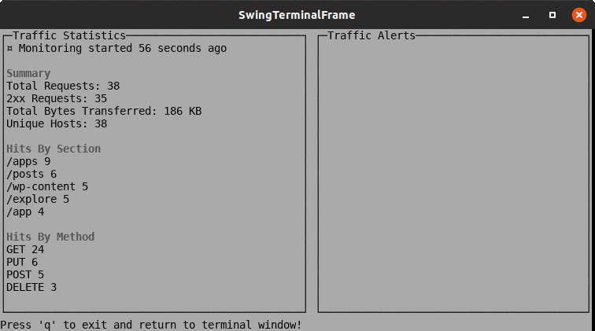

# HTTP Log Monitoring Console App

Consumes an actively written to w3c-formatted HTTP access log and provides metrics.

## Code Challenge

Create a simple console program that monitors HTTP traffic on your machine:

>- Consume an actively written-to [w3c-formatted HTTP access log](https://en.wikipedia.org/wiki/Common_Log_Format). It should default to reading /tmp/access.log and be overrideable.
>- Every 10s, display in the console the sections of the web site with the most hits (a section is defined as being what's before the second '/' in a URL. i.e. the section for "http://my.site.com/pages/create' is "http://my.site.com/pages"), as well as interesting summary statistics on the traffic as a whole.
>- Make sure a user can keep the console app running and monitor traffic on their machine
>- Whenever total traffic for the past 2 minutes exceeds a certain number on average, add a message saying that “High traffic generated an alert - hits = {value}, triggered at {time}”
>- Whenever the total traffic drops again below that value on average for the past 2 minutes, add another message detailing when the alert recovered.
>- Make sure all messages showing when alerting thresholds are crossed remain visible on the page for historical reasons.
>- Write a test for the alerting logic

# Requirements
Java 8 runtime environment.

If you have a Docker environment and don't want to install Java, there is a [Dockerfile](Dockerfile).

## Usage

### Run
Run the application using the bash wrapper:

```bash
./stats.sh
```

Press control-C to shut down the UI and return to the ordinary prompt. 

For all possible options, run:
```bash
./stats.sh --help
```
This should print:
```
usage: ./stats.sh [-d <arg>] [-f <arg>] [-r <arg>] [-t <arg>]
 -d,--monitor-duration <arg>   alert duration in seconds, default 120
 -f,--log-file <arg>           access log file location, default /tmp/access.log
 -r,--report-interval <arg>    interval for showing traffic reports in seconds, default 10
 -t,--alert-threshold <arg>    alert threshold in hits/sec, default 100
```

For example,

```bash
./stats.sh -f /var/log/access.log -r 1 -t 60 -d 10
```

### Build
If you want to build a fresh copy of the application, you need to use maven:
```bash
mvn clean install
```

then move the built jar so the bash wrapper can find it:

```bash
cp target/stats.jar .
```

### Fake Logs

You can use [apache-fake-log-gen.py](https://github.com/kiritbasu/Fake-Apache-Log-Generator) to generate fake Common Log Formatted access logs.
To control the rate at which log lines are generated, you can play with `--sleep` option.
```bash
python apache-fake-log-gen.py --log-format CLF --num 0 --sleep 0.01 > /var/log/access.log
```

Note: I had to modify the script in order to generate logs with correct dates.

## Design Overview
For this application, I wanted an architecture which allows different components to communicate with each other while maintaining loose coupling and separation of concerns principles.

### Application Architecture
Bellow the application architecture diagram.



As you can see, it's an event-driven architecture thanks to a central Event Bus which allows publish-subscribe communication between the application components.

The advantage of this architecture is that we can easily add new features without having to touch the existing components.
So let's say, for example, we decide to persist traffic alerts into a JSON file. All we have to do is to create a separate component, make it listen for traffic alert events, and finally implement the logic there.
This allows to keep logic well separated on the class where it's needed (separation of concerns design principle).

### Application Components
All application components are designed with the single responsibility principle in mind.
Also each component has its own separate package.

#### File Watcher
This component is simply responsible for reading new lines from a text file while it is being generated.
It does not have to be necessarily a Common Log Format log file.
This makes this component reusable by other type of applications.

Click [here](src/main/java/org/sample/homework/reader) for more details about the implementation of this component.

#### Access Log Record Producer
This class is responsible for parsing Common Log Format access log records from the lines generated by the file watcher.
Those access log records are then published to the event bus so they can be sent to there consumers.

Click [here](src/main/java/org/sample/homework/clf) for more details about the implementation of this component.

#### Traffic Statistics Manager
This component is responsible for generating (and publishing) traffic summaries at regular intervals based on the consumed access log records.

Click [here](src/main/java/org/sample/homework/stats) for more details about the implementation of this component.

#### Traffic Alerts Manager
This component is responsible for generating (and publishing) traffic alerts. It relies on stats summaries.

Click [here](src/main/java/org/sample/homework/alerts) for more details about the implementation of this component.

#### UI
This component is responsible for printing traffic summaries and alerts to the screen.

Click [here](src/main/java/org/sample/homework/ui) for more details about the implementation of this component.

## Code Structure
```
└── homework
   ├── alerts
   │   ├── TrafficAlert.java
   │   └── TrafficAlertManager.java
   ├── clf
   │   ├── AccessLogParseException.java
   │   ├── AccessLogParser.java
   │   ├── AccessLogRecord.java
   │   ├── AccessLogRecordProducer.java
   │   ├── CommonLogFormatUtils.java
   │   └── RegexAccessLogParser.java
   ├── reader
   │   ├── FileWatcher.java
   │   ├── LineListener.java
   │   └── PollingFileWatcher.java
   ├── stats
   │   ├── TrafficStatistics.java
   │   └── TrafficStatisticsManager.java
   ├── ui
   │   ├── ConsoleGui.java
   │   └── StatsWindow.java
   ├── util
   │   └── DateTimeUtils.java
   │
   ├── Application.java
   └── ApplicationOptions.java
```

## Tests

To run the tests you need to use maven.

```sh
mvn test
```

The alerting logic test can be found [here](src/test/java/org/sample/homework/alerts/TrafficAlertManagerTest.java).
There are also some [other tests](src/test/java/org/sample/homework).

## Improvement Ideas

* Try to implement a file watcher using WatchService API which is driven by the file system change events triggered by the operating system.
 This approach saves the application from polling the file system repeatedly for changes.
  Also one can consider an asynchronous non-blocking framework for better I/O efficiency.
* Implement more standard log formats (NCSA extended/combined, Common Log Format with Virtual Host, etc.).
* The UI component could be reworked. If I had more time, I'd spend it to understand the internals of the [ui library](https://github.com/mabe02/lanterna)
 in order to use it more efficiently. This is also due to the lack of good online documentation for this library.
* Make the traffic alert section scrollable.
* Improve code coverage. Owing to time constraints not all parts of the application are unit-tested.
* Think about an architecture which scales in a production environment (multiple instances in a cluster).
 For example, one could send traffic stats and alerts to a distributed store like Redis. Then stream them to a web application using WebSockets.
 
## License

This package is open-sourced software licensed under the [MIT license](https://opensource.org/licenses/MIT).

## Screenshots



The screen has two main parts:

1. Traffic Statistics: contains traffic summary gathered during the last window frame
2. Traffic Alerts: contains the latest traffic alerts and recoveries